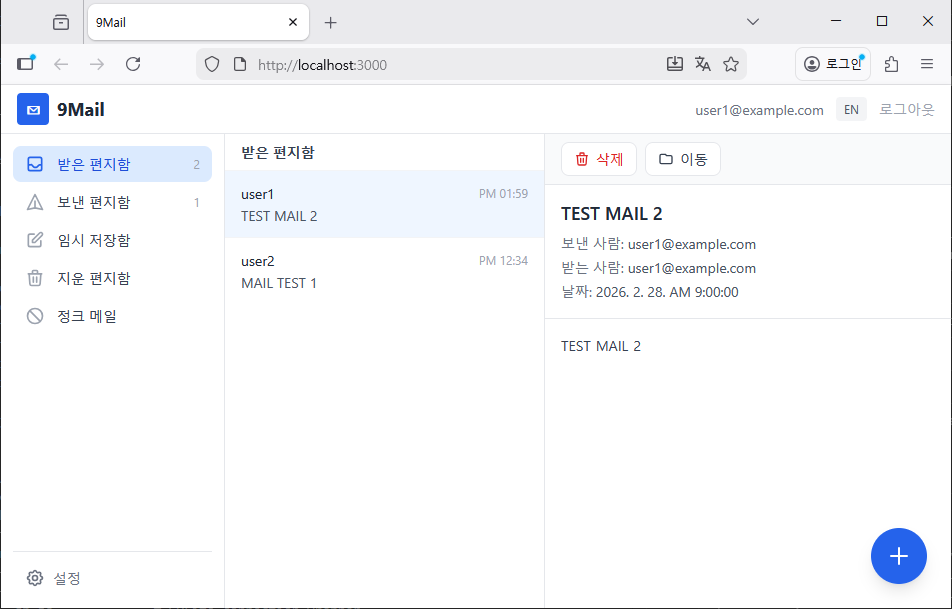

# Web Mail Client for 9Mail

This is a lightweight webmail application for 9Mail Server, developed entirely using AI.

Check the following URL and install 9Mail Server first.

https://github.com/gujc71/9Mail




## Tech Stack

| Layer | Technology |
|-------|-----------|
| **Frontend** | React 18, Vite 6, Tailwind CSS 3 |
| **Backend** | Node.js, Express 4 |
| **Database** | SQLite (via better-sqlite3) |
| **Auth** | JWT (jsonwebtoken) |
| **Mail Parsing** | mailparser |
| **Mail Sending** | nodemailer (SMTP relay) |

## Project Structure

```
9MailW/
├── package.json          # Server dependencies & scripts
├── schema.sql            # SQLite schema definition
├── data/                 # SQLite DB file (auto-created)
├── server/
│   ├── index.js          # Express entry point
│   ├── config.js         # Server configuration
│   ├── db.js             # SQLite connection wrapper
│   ├── middleware/
│   │   ├── auth.js       # JWT authentication middleware
│   │   └── logger.js     # Request & event logger
│   └── routes/
│       ├── auth.js       # Login / token endpoints
│       ├── mail.js       # Mail list & detail endpoints
│       ├── mailbox.js    # Mailbox CRUD endpoints
│       └── send.js       # SMTP send endpoint
└── client/
    ├── package.json      # Client dependencies & scripts
    ├── vite.config.js    # Vite dev server & proxy config
    └── src/
        ├── App.jsx
        ├── api.js        # API helper functions
        ├── index.jsx
        ├── index.css     # Tailwind imports
        ├── components/   # React UI components
        ├── contexts/     # Auth & i18n context providers
        └── i18n/         # Translation strings
```

## Prerequisites

- **Node.js** 18 or later
- **npm** 8 or later

## Configuration

Edit `server/config.js` or set environment variables:

| Variable | Default | Description |
|----------|---------|-------------|
| `PORT` | `4000` | HTTP server port |
| `DB_DIR` | `9Mail/data/` | 9Mail Server's SQLite database directory |
| `JWT_SECRET` | `change-me-9mail-secret-key` | JWT signing secret |
| `MAILDIR` | `9Mail/data/maildir` | 9Mail Server's Directory containing EML files |
| `SMTP_HOST` | `127.0.0.1` | Outgoing SMTP relay host |
| `SMTP_PORT` | `25` | Outgoing SMTP relay port |

## Getting Started

### 1. Install dependencies

```bash
# Server
npm install

# Client
cd client
npm install
```

### 2. Initialize the database

The database is automatically created on first server start using the schema defined in `schema.sql`.

### 3. Run in development mode

Start the backend (with auto-reload):

```bash
npm run dev
```

In a separate terminal, start the frontend dev server:

```bash
cd client
npm start
```

- Frontend: http://localhost:3000 (proxies `/api` requests to the backend)
- Backend API: http://localhost:4000

### 4. Build for production

```bash
cd client
npm run build
```

Then start the server, which serves the built client as static files:

```bash
npm start
```

The application will be available at http://localhost:4000.

## API Endpoints

All endpoints except `/api/auth/*` require a valid JWT token in the `Authorization` header.

| Method | Endpoint | Description |
|--------|----------|-------------|
| POST | `/api/auth/login` | Authenticate and obtain JWT |
| GET | `/api/mailboxes` | List mailboxes for the user |
| GET | `/api/mails?mailbox_id=&page=&limit=` | List mails in a mailbox |
| GET | `/api/mails/:message_id` | Get single mail content (parsed EML) |
| POST | `/api/send` | Send mail via SMTP |

## Database Schema

The SQLite database consists of four main tables:

- **MAIL_USER** — User accounts (email, SHA-256 hashed password)
- **MAIL_MAILBOX** — Mailbox folders per account
- **MAIL_MESSAGE** — Message metadata (subject, sender, date, EML filename)
- **MAIL_MAIL** — Per-mailbox mail entries (read/flag status, receive date/time)
- **MAIL_RECIPIENT** — Deduplicated recipient list per message

## License

MIT
